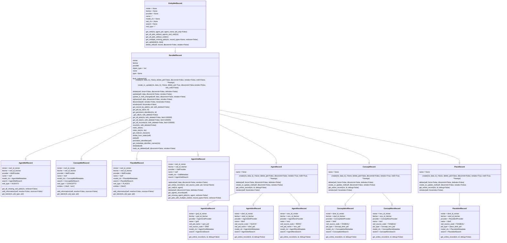

https://mermaid.live

```mermaid
classDiagram
class ReroMefRecord{
    minter
    fetcher
    provider
    object_type = 'rec'
    name
    type = None
    flush_indexes(cls)
    create(cls, data, id_=None, delete_pid=False, dbcommit=False, reindex=False, md5=False, **kwargs)
    create_or_update(cls, data, id_=None, delete_pid=True, dbcommit=False,reindex=False, test_md5=False)
    delete(self, force=False, dbcommit=False, delindex=False)
    update(self, data, dbcommit=False, reindex=False)
    update_if_md5_changed(self, data, dbcommit=False, reindex=False)
    replace(self, data, dbcommit=False, reindex=False)
    dbcommit(self, reindex=False, forceindex=False)
    reindex(self, forceindex=False)
    get_record_by_pid(cls, pid, with_deleted=False)
    get_pid_by_id(cls, id)
    get_persistent_identifier(cls, id)
    _get_all(cls, with_deleted=False)
    get_all_pids(cls, with_deleted=False, limit=100000)
    get_all_ids(cls, with_deleted=False, limit=100000)
    get_all_records(cls, with_deleted=False, limit=100000)
    count(cls, with_deleted=False)
    index_all(cls)
    index_ids(cls, ids)
    get_indexer_class(cls)
    delete_from_index(self)
    pid(self)
    persistent_identifier(self)
    get_metadata_identifier_names(cls)
    deleted(self)
    mark_as_deleted(self, dbcommit=False, reindex=False)

}

class EntityMefRecord{
    minter = None
    fetcher = None
    provider = None
    name = ''
    model_cls = None
    viaf_cls = None
    search = None
    mef_type = ''
    get_mef(cls, agent_pid, agent_name, pid_only=False)
    get_all_pids_without_agents_and_viaf(cls)
    get_all_pids_without_viaf(cls)
    get_multiple_missing_pids(cls, record_types=None, verbose=False)
    get_updated(cls, data)
    delete_ref(self, record, dbcommit=False, reindex=False)
}

class AgentMefRecord{
    minter = mef_id_minter
    fetcher = mef_id_fetcher
    provider = MefProvider
    name = 'mef'
    model_cls = AgentMefMetadata
    search = AgentMefSearch
    mef_type = 'AGENTS'
    get_all_missing_viaf_pids(cls, verbose=False)
    add_information(self, resolve=False, sources=False)
    get_latest(cls, pid_type, pid)
}

class ConceptMefRecord{
    minter = mef_id_minter
    fetcher = mef_id_fetcher
    provider = MefProvider
    name = 'mef'
    model_cls = ConceptMefMetadata
    search = ConceptMefSearch
    mef_type = 'CONCEPTS'
    entities = ['idref', 'rero']
    add_information(self, resolve=False, sources=False)
    get_latest(cls, pid_type, pid)
}

class PlaceMefRecord{
    minter = mef_id_minter
    fetcher = mef_id_fetcher
    provider = MefProvider
    name = 'mef'
    model_cls = PlaceMefMetadata
    search = PlaceMefSearch
    mef_type = 'PLACES'
    entities = ['idref']
    add_information(self, resolve=False, sources=False)
    get_latest(cls, pid_type, pid)
}

class AgentViafRecord{
    minter = viaf_id_minter
    fetcher = viaf_id_fetcher
    provider = ViafProvider
    name = 'viaf'
    model_cls = ViafMetadata
    search = AgentViafSearch
    replace(self, data, dbcommit=False, reindex=False)
    get_online_record(cls, viaf_source_code, pid, format=None)
    get_viaf(cls, agent)
    delete(self, dbcommit=False, delindex=False)
    get_agents_records(self)
    get_missing_agent_pids(cls, agent, verbose=False)
    get_pids_with_multiple_viaf(cls, record_types=None, verbose=False)
}

class AgentRecord{
    name = None
    create(cls, data, id_=None, delete_pid=False, dbcommit=False, reindex=True, md5=True, **kwargs)
    delete(self, force=False, dbcommit=False, delindex=False)
    create_or_update_mef(self, dbcommit=False, reindex=False)
    get_online_record(cls, id, debug=False)
    reindex(self, forceindex=False)
}

class ConceptRecord{
    name = None
    create(cls, data, id_=None, delete_pid=False, dbcommit=False, reindex=True, md5=True, **kwargs)
    delete(self, force=False, dbcommit=False, delindex=False)
    create_or_update_mef(self, dbcommit=False, reindex=False)
    get_online_record(cls, id, debug=False)
    reindex(self, forceindex=False)
}

class PlaceRecord{
    name = None
    create(cls, data, id_=None, delete_pid=False, dbcommit=False, reindex=True, md5=True, **kwargs)
    delete(self, force=False, dbcommit=False, delindex=False)
    create_or_update_mef(self, dbcommit=False, reindex=False)
    get_online_record(cls, id, debug=False)
    reindex(self, forceindex=False)
}

class ConceptIdrefRecord {
    minter = idref_id_minter
    fetcher = idref_id_fetcher
    provider = ConceptIdrefProvider
    name = 'idref'
    viaf_source_code = 'RAMEAU'
    pid_type = 'concept_idref_pid'
    model_cls = ConceptIdrefMetadata
    search = ConceptIdrefSearch
    get_online_record(cls, id, debug=False)
}

class ConceptReroRecord {
    minter = rero_id_minter
    fetcher = rero_id_fetcher
    provider = ConceptReroProvider
    name = 'rero'
    viaf_source_code = 'RAMEAU'
    pid_type = 'concept_rero_pid'
    model_cls = ConceptReroMetadata
    search = ConceptReroSearch
    get_online_record(cls, id, debug=False)
}

class AgentGndRecord{
    minter = gnd_id_minter
    fetcher = gnd_id_fetcher
    provider = AgentGndProvider
    name = 'gnd'
    viaf_pid_name = 'gnd_pid'
    viaf_source_code = 'DNB'
    model_cls = AgentGndMetadata
    search = AgentGndSearch
    get_online_record(cls, id, debug=False)
}

class AgentIdrefRecord{
    minter = idref_id_minter
    fetcher = idref_id_fetcher
    provider = AgentIdrefProvider
    name = 'idref'
    viaf_source_code = 'SUDOC'
    viaf_pid_name = 'idref_pid'
    model_cls = AgentIdrefMetadata
    search = AgentIdrefSearch
    get_online_record(cls, id, debug=False)
}

class AgentReroRecord{
    minter = rero_id_minter
    fetcher = rero_id_fetcher
    provider = AgentReroProvider
    name = 'rero'
    viaf_source_code = 'RERO'
    viaf_pid_name = 'rero_pid'
    model_cls = AgentReroMetadata
    search = AgentReroSearch
    get_online_record(cls, id, debug=False)
}

class PlaceIdrefRecord {
    minter = idref_id_minter
    fetcher = idref_id_fetcher
    provider = PlaceIdrefProvider
    name = 'idref'
    viaf_source_code = 'RAMEAU'
    pid_type = 'place_idref_pid'
    model_cls = PlaceIdrefMetadata
    search = PlaceIdrefSearch
    get_online_record(cls, id, debug=False)
}

EntityMefRecord --|> ReroMefRecord
ReroMefRecord --|> AgentMefRecord
ReroMefRecord --|> ConceptMefRecord
ReroMefRecord --|> PlaceMefRecord

ReroMefRecord --|> AgentViafRecord

ReroMefRecord --|> AgentRecord
AgentRecord --|> AgentGndRecord
AgentRecord --|> AgentIdrefRecord
AgentRecord --|> AgentReroRecord

ReroMefRecord --|> ConceptRecord
ConceptRecord --|> ConceptIdrefRecord
ConceptRecord --|> ConceptReroRecord

ReroMefRecord --|> PlaceRecord
PlaceRecord --|> PlaceIdrefRecord
```