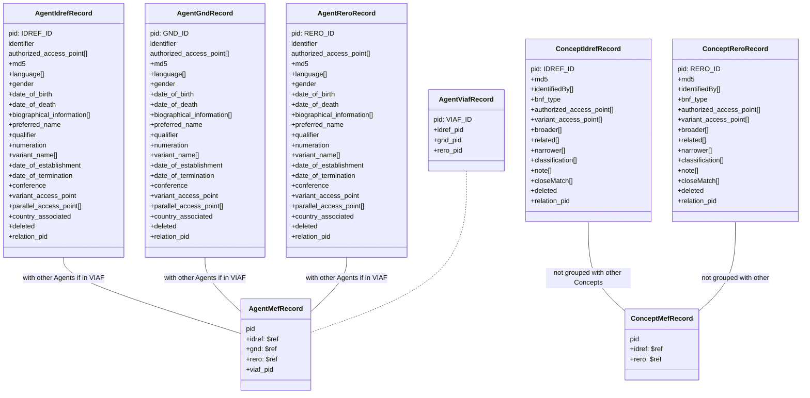

https://mermaid.live

```mermaid
classDiagram
    class AgentMefRecord {
        pid
        +idref: $ref
        +gnd: $ref
        +rero: $ref
        +viaf_pid
    }

    class AgentViafRecord {
        pid: VIAF_ID
        +idref_pid
        +gnd_pid
        +rero_pid
    }

    class AgentIdrefRecord {
        pid: IDREF_ID
        identifier
        authorized_access_point[]
        +md5
        +language[]
        +gender
        +date_of_birth
        +date_of_death
        +biographical_information[]
        +preferred_name
        +qualifier
        +numeration
        +variant_name[]
        +date_of_establishment
        +date_of_termination
        +conference
        +variant_access_point
        +parallel_access_point[]
        +country_associated
        +deleted
        +relation_pid
}

    class AgentGndRecord {
        pid: GND_ID
        identifier
        authorized_access_point[]
        +md5
        +language[]
        +gender
        +date_of_birth
        +date_of_death
        +biographical_information[]
        +preferred_name
        +qualifier
        +numeration
        +variant_name[]
        +date_of_establishment
        +date_of_termination
        +conference
        +variant_access_point
        +parallel_access_point[]
        +country_associated
        +deleted
        +relation_pid
    }

    class AgentReroRecord {
        pid: RERO_ID
        identifier
        authorized_access_point[]
        +md5
        +language[]
        +gender
        +date_of_birth
        +date_of_death
        +biographical_information[]
        +preferred_name
        +qualifier
        +numeration
        +variant_name[]
        +date_of_establishment
        +date_of_termination
        +conference
        +variant_access_point
        +parallel_access_point[]
        +country_associated
        +deleted
        +relation_pid
    }

    AgentIdrefRecord  -- AgentMefRecord : with other Agents if in VIAF
    AgentGndRecord  -- AgentMefRecord : with other Agents if in VIAF
    AgentReroRecord  -- AgentMefRecord : with other Agents if in VIAF
    AgentViafRecord  .. AgentMefRecord


    class ConceptMefRecord{
        pid
        +idref: $ref
        +rero: $ref
    }


    class ConceptIdrefRecord{
        pid: IDREF_ID
        +md5
        +identifiedBy[]
        +bnf_type
        +authorized_access_point[]
        +variant_access_point[]
        +broader[]
        +related[]
        +narrower[]
        +classification[]
        +note[]
        +closeMatch[]
        +deleted
        +relation_pid
}

    class ConceptReroRecord{
        pid: RERO_ID
        +md5
        +identifiedBy[]
        +bnf_type
        +authorized_access_point[]
        +variant_access_point[]
        +broader[]
        +related[]
        +narrower[]
        +classification[]
        +note[]
        +closeMatch[]
        +deleted
        +relation_pid
    }

    ConceptIdrefRecord -- ConceptMefRecord: not grouped with other Concepts
    ConceptReroRecord -- ConceptMefRecord: not grouped with other
```