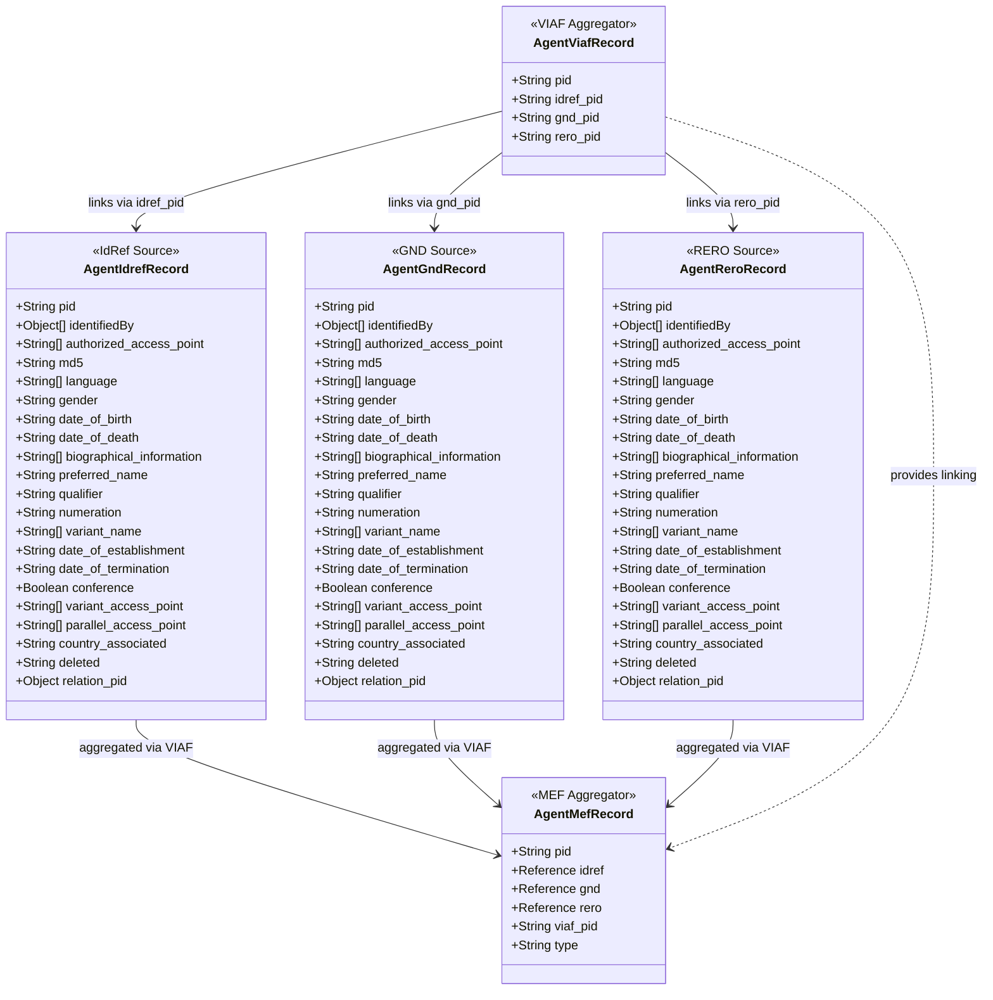
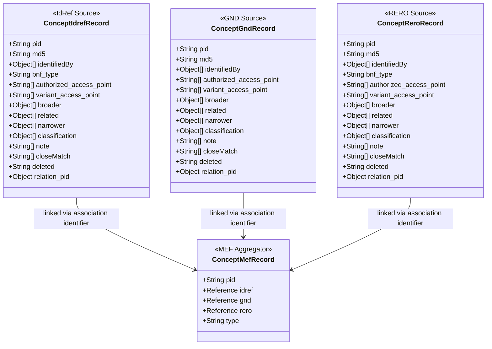
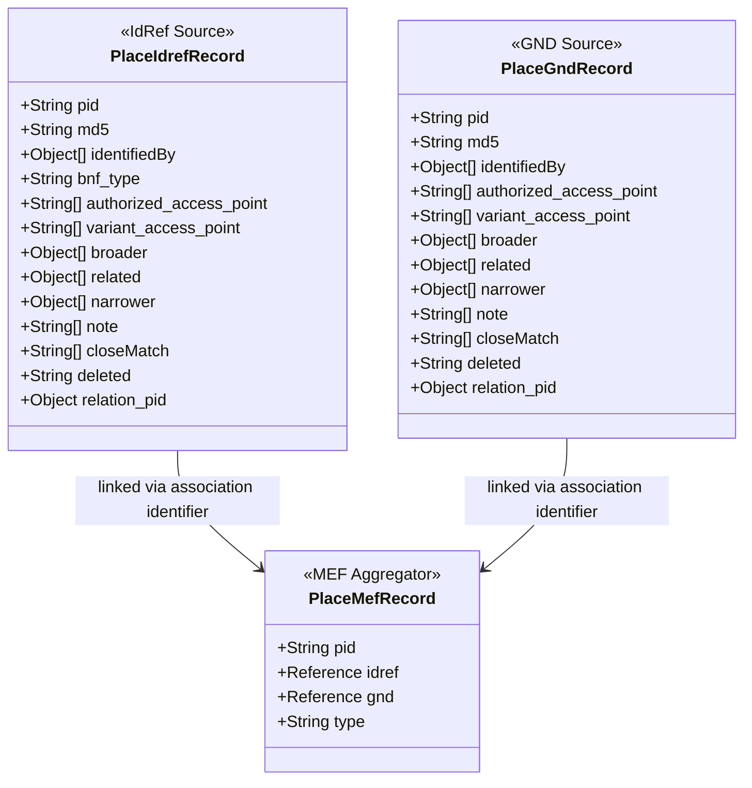

<!--
SPDX-FileCopyrightText: Fondation RERO+
SPDX-License-Identifier: AGPL-3.0-or-later
-->

# RERO MEF Data Model Overview

View and edit diagrams at: [mermaid.live](https://mermaid.live)

## Agent Records

## Concept Records

> **No VIAF integration:** VIAF (Virtual International Authority File) only aggregates
> name authority records — persons, corporate bodies, and families. It does not cover
> subject/concept authority records, so there is no `ConceptViafRecord` equivalent and
> `ConceptMefRecord` carries no `viaf_pid` field.
>
> **Linking mechanism:** Concept records are linked directly via cross-reference
> identifiers embedded in each source record's `identifiedBy` field (e.g. a BNF code
> such as `FRBNF12345678` stored by an IdRef record, or a GND code stored by a GND
> record). The `association_identifier` property extracts this identifier and
> `get_association_record()` uses it to locate the counterpart record in another source.
> Both are then stored as `$ref` links inside a shared `ConceptMefRecord`.

## Place Records

> **Note:** RERO does not publish place authority data, so there is no PlaceReroRecord
> and `PlaceMefRecord` has no `rero` reference field. This is intentional and differs
> from the Agent and Concept sections where all three sources (IdRef, GND, RERO) exist.
>
> **Linking mechanism:** Same association-identifier pattern as Concept records. An
> IdRef place record carries a GND code in its `identifiedBy` field (source `"GND"`,
> value prefixed with `"(DE-101)"`). The `association_identifier` property strips the
> prefix and uses it to locate the matching `PlaceGndRecord`, which is then stored
> together with the IdRef record as `$ref` links inside a shared `PlaceMefRecord`.

